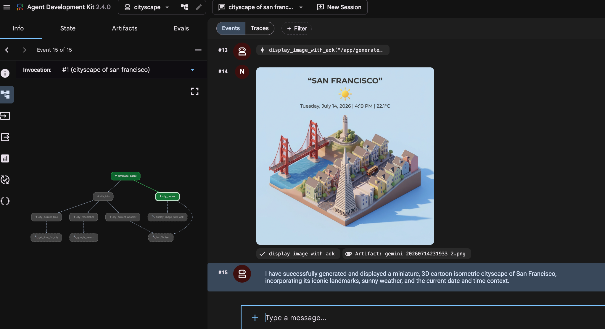

# Cityscape ADK agent deployed to Cloud Run
# Cloud Run feature highlights: sandbox and MCP servers

This repository contains a Cityscape agent built with the Agent Development Kit (ADK) and deployed on Google Cloud Run. The project demonstrates how to orchestrate multiple Google Cloud capabilities to generate dynamic cityscape images from user prompts:

1. **Google-managed Maps Grounding Lite MCP Server** retrieves real-time location and weather data.
2. **Cloud Run Nested Sandbox** securely executes a Python script to compute the city's current local time with network egress.
3. **Nano Banana (Gemini image generation model)** synthesizes the live weather, local time, and iconic city landmarks into a stylized 3D cityscape image. You can also specify the theme of your cityscape image via the user prompt (e.g., *"Generate a cityscape of New York in Game of Thrones style"*).

## Prerequisites & Environment Setup

Set your Google Cloud project ID variable so it can be used across the setup commands:

```sh
export PROJECT_ID=$(gcloud config get-value project)
```

## Activate GCP Services

Enable all required Google Cloud APIs (Vertex AI, Artifact Registry, Cloud Build, Cloud Run, Secret Manager, API Keys, IAM, and Google Maps backend services):

```sh
gcloud services enable \
    aiplatform.googleapis.com \
    artifactregistry.googleapis.com \
    cloudbuild.googleapis.com \
    run.googleapis.com \
    secretmanager.googleapis.com \
    apikeys.googleapis.com \
    iam.googleapis.com \
    mapstools.googleapis.com \
    geocoding-backend.googleapis.com \
    timezone-backend.googleapis.com \
    --project $PROJECT_ID
```

> **Note:** Separate MCP endpoint enablement (`gcloud beta services mcp enable`) is no longer required; enabling `mapstools.googleapis.com` via `gcloud services enable` automatically activates the Maps Grounding Lite MCP endpoint.

## MCP Servers

The following MCP servers need to be prepared:

### Google Maps Grounding Lite MCP Server

See official [documentation](https://developers.google.com/maps/ai/grounding-lite).

Create a Maps API Key and restrict it to `mapstools.googleapis.com`, `geocoding-backend.googleapis.com`, and `timezone-backend.googleapis.com`:

```sh
gcloud services api-keys create \
    --display-name="Cityscape Maps MCP" \
    --key-id="cityscape-maps-mcp" \
    --api-target="service=mapstools.googleapis.com" \
    --api-target="service=geocoding-backend.googleapis.com" \
    --api-target="service=timezone-backend.googleapis.com" \
    --project $PROJECT_ID
```

Export it as an environment variable for local development:

```sh
export MAPS_API_KEY="$(gcloud services api-keys get-key-string "cityscape-maps-mcp" --project $PROJECT_ID --format "value(keyString)")"
```

### Nano Banana via GenMedia MCP Server

See official [documentation](https://github.com/GoogleCloudPlatform/vertex-ai-creative-studio/tree/main/experiments/mcp-genmedia) for details on the GenMedia MCP server. For local development, install the `mcp-gemini-go` binary using Go and ensure your Go bin directory is in your `PATH`:

```sh
go install github.com/GoogleCloudPlatform/vertex-ai-creative-studio/experiments/mcp-genmedia/mcp-genmedia-go/mcp-gemini-go@latest
export PATH="$(go env GOPATH)/bin:$PATH"
```

## Get Started (Local Development)

Create a virtual environment and install dependencies:

```sh
python3 -m venv .venv
source .venv/bin/activate
pip install -r requirements.txt
```

Configure Vertex AI environment variables and launch the ADK web interface:

```sh
export GOOGLE_CLOUD_PROJECT=$PROJECT_ID
export GOOGLE_CLOUD_LOCATION=global
export GOOGLE_GENAI_USE_VERTEXAI=true

adk web ./agents
```

Try a prompt like (with any arbitrary city):

```txt
Generate a cityscape for Zurich
```

## Deploy to Cloud Run

### Build Permissions

Ensure the default Compute Engine service account (used by Cloud Build for source deployments) has permissions to build and push containers (`roles/run.builder` or granular storage, Artifact Registry, and logging roles):

```sh
PROJECT_NUMBER=$(gcloud projects describe $PROJECT_ID --format='value(projectNumber)')
gcloud projects add-iam-policy-binding $PROJECT_ID \
    --member="serviceAccount:${PROJECT_NUMBER}-compute@developer.gserviceaccount.com" \
    --role="roles/run.builder"
gcloud projects add-iam-policy-binding $PROJECT_ID \
    --member="serviceAccount:${PROJECT_NUMBER}-compute@developer.gserviceaccount.com" \
    --role="roles/storage.objectUser"
gcloud projects add-iam-policy-binding $PROJECT_ID \
    --member="serviceAccount:${PROJECT_NUMBER}-compute@developer.gserviceaccount.com" \
    --role="roles/artifactregistry.writer"
gcloud projects add-iam-policy-binding $PROJECT_ID \
    --member="serviceAccount:${PROJECT_NUMBER}-compute@developer.gserviceaccount.com" \
    --role="roles/logging.logWriter"
```

### Create Service Account

Create a dedicated runtime service account for the Cloud Run application:

```sh
SERVICE_ACCOUNT_NAME="cityscape-sa"
gcloud iam service-accounts create $SERVICE_ACCOUNT_NAME \
    --display-name="Cityscape Agent Service Account" \
    --project=$PROJECT_ID
```

Grant the necessary permissions (Vertex AI User for model access, Logging and Monitoring for observability):

```sh
gcloud projects add-iam-policy-binding $PROJECT_ID \
    --member="serviceAccount:${SERVICE_ACCOUNT_NAME}@${PROJECT_ID}.iam.gserviceaccount.com" \
    --role="roles/aiplatform.user"
gcloud projects add-iam-policy-binding $PROJECT_ID \
    --member="serviceAccount:${SERVICE_ACCOUNT_NAME}@${PROJECT_ID}.iam.gserviceaccount.com" \
    --role="roles/logging.logWriter"
gcloud projects add-iam-policy-binding $PROJECT_ID \
    --member="serviceAccount:${SERVICE_ACCOUNT_NAME}@${PROJECT_ID}.iam.gserviceaccount.com" \
    --role="roles/monitoring.metricWriter"
```

### Setup Maps API Key Secret

Create a secret for the Maps API Key in Secret Manager (stripping any trailing newline from `gcloud` output before storing):

```sh
gcloud secrets create maps-api-key --replication-policy="automatic" --project=$PROJECT_ID
gcloud services api-keys get-key-string "cityscape-maps-mcp" --project $PROJECT_ID --format "value(keyString)" \
  | tr -d '\n' \
  | gcloud secrets versions add maps-api-key --data-file=- --project=$PROJECT_ID
```

Grant the runtime service account access to the secret:

```sh
gcloud secrets add-iam-policy-binding maps-api-key \
    --member="serviceAccount:${SERVICE_ACCOUNT_NAME}@${PROJECT_ID}.iam.gserviceaccount.com" \
    --role="roles/secretmanager.secretAccessor" \
    --project=$PROJECT_ID
```

### Deploy Service

> **Note on Cloud Run Sandbox execution:** This application requires the Cloud Run execution sandbox (`--sandbox-launcher`) to securely run the `get_time.py` script dynamically with network egress. Because `--sandbox-launcher` is a preview feature, use `gcloud beta run deploy` to deploy and enable the sandbox in a single step.

Ensure your `gcloud` components are up to date and deploy the service:

```sh
gcloud components update

CLOUD_RUN_REGION=europe-west1

gcloud beta run deploy cityscape-agent-sandbox \
  --source . \
  --region $CLOUD_RUN_REGION \
  --project $PROJECT_ID \
  --allow-unauthenticated \
  --sandbox-launcher \
  --service-account="${SERVICE_ACCOUNT_NAME}@${PROJECT_ID}.iam.gserviceaccount.com" \
  --set-env-vars="GOOGLE_CLOUD_PROJECT=$PROJECT_ID,GOOGLE_CLOUD_LOCATION=global,GOOGLE_GENAI_USE_VERTEXAI=true,SERVE_WEB_INTERFACE=true" \
  --set-secrets="MAPS_API_KEY=maps-api-key:latest"
```

*(Optional)* If you deployed the service using standard `gcloud run deploy` without `--sandbox-launcher`, you can enable the sandbox on an existing service at any time by running:

```sh
gcloud beta run services update cityscape-agent-sandbox \
  --sandbox-launcher \
  --region $CLOUD_RUN_REGION \
  --project $PROJECT_ID
```

### Testing the Deployed Service

1. **Quick testing (Public access):**
   Because the deployment command above includes `--allow-unauthenticated`, you can open the **Service URL** printed in the deployment output directly in your browser to test the web interface immediately.

2. **Strong security (Private access):**
   For production or restricted environments, deploy (or update) the service using `--no-allow-unauthenticated` instead of `--allow-unauthenticated`. You can then securely access the service using either:
   - **[Cloud Run auth proxy](https://cloud.google.com/sdk/gcloud/reference/run/services/proxy)** for local testing:
     ```sh
     gcloud run services proxy cityscape-agent-sandbox \
       --region $CLOUD_RUN_REGION \
       --project $PROJECT_ID
     ```
     Then open `http://localhost:8080` in your browser.
   - **[Cloud Run Identity-Aware Proxy (IAP)](https://cloud.google.com/run/docs/securing/identity-aware-proxy-cloud-run)** for authenticated browser access.

## Screenshot



## Example Generated Images

Here are some examples of what this agent generates

| Rome | Singapore | Zurich | Zurich (Nano Banana Pro) |
|---|---|---|---|
|  |  |  | | 

## Disclaimer

This is not an official Google product.
